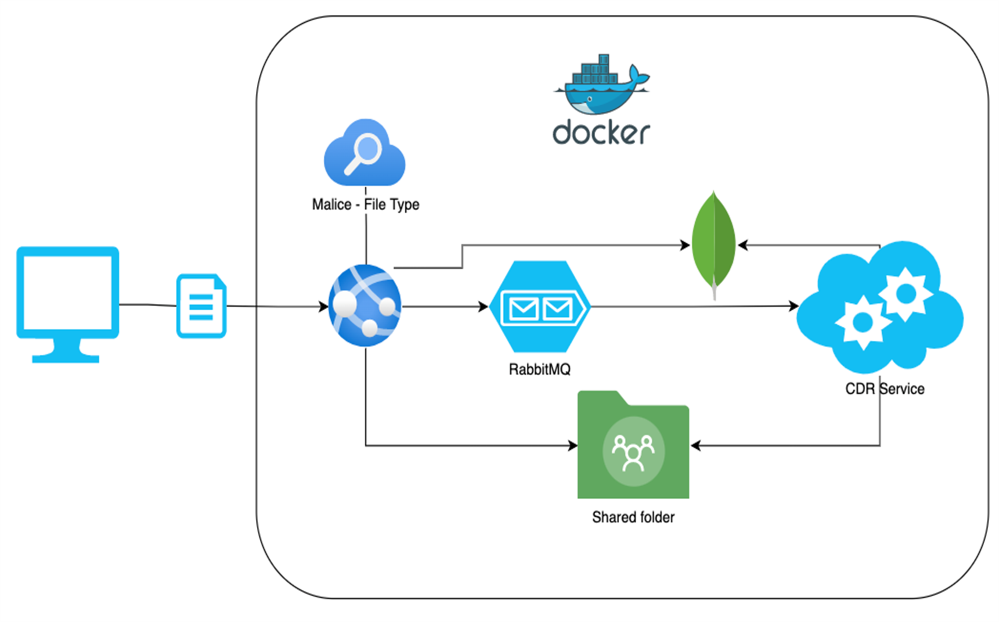

# opencdr-js

**Developers:** 
- Vue.js: Rony Ronen, Eli Levi
- CDR: Ran Dubin, Amit-Sheer Cohen, Eli Belkin

## Overview
This is a web application development for Containment, Disarm and Reconstruct (CDR). The CDR itself is based on the Springbot architecture and was developed earlier. We used the CDR application and built a web application around it.  
There are 2 development paths in this project.  
### Fullstack
- Responsible for the development of the website
- Divide of the CDR backend app to components and services
- Making it easy to deploy and maintainable 
### Image CDR
-

 
## Dependencies
### Frontend:
* Node.js (=> 14)
* Vue.js: See more in <code>package.json</code>.
* tailwind-css
* XMLHttpRequest
  
### Backend:
* Java ( => 15)
* Maven
* Springboot
* [Docker](https://docs.docker.com/get-docker/) (>=20.10)
* [Docker Compose](https://docs.docker.com/compose/install/) (>=1.29)
* Docker Compose: See more in <code>docker-compose.yml</code>

## Architecture
The system is made of 3 developed parts: 
* backend/cdr-rest: reponsible for the handeling incoming http requests
* backend/open-cdr: responsible for running the cdr process on the incoming files
* client/opencdr-vue-js: UI to send files through and view results

Additional services used are:
* Mongodb: saving data on file cdr process execution
* RabbitMQ: pass files data to the cdr process( future possability for custom topic handeling by file type)
* Malice/fileinfo: runs on files to get the file type

